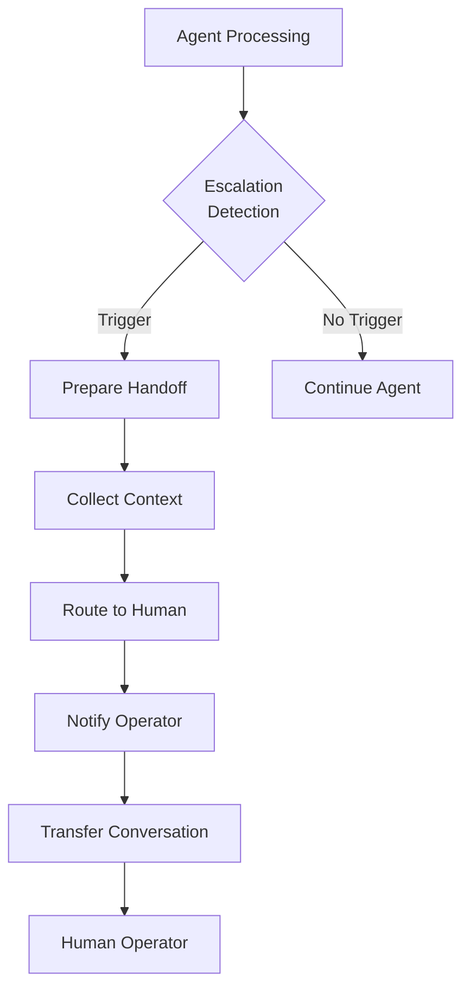

# Human Handoff Pattern

## Abstract

The Human Handoff pattern transfers control from an AI agent to a human operator when the agent cannot handle a request. By detecting escalation triggers, preserving conversation context, and providing a smooth transition, this pattern ensures users receive appropriate assistance when automated systems reach their limits.

## Problem Statement

AI agents have limitations and cannot handle all requests. When an agent encounters a situation beyond its capabilities, the problem is how to seamlessly transfer the conversation to a human operator while preserving context, maintaining user trust, and ensuring the handoff is timely and appropriate.

## Context

This pattern arises when:
- Agent confidence is consistently low
- User explicitly requests human assistance
- Sensitive or high-stakes decisions are required
- Legal or compliance requirements mandate human review
- User frustration is detected

## Forces

- **Automation vs. Human Touch:** Automation is efficient; humans handle edge cases
- **Speed vs. Quality:** Immediate handoff is fast; delayed may improve resolution
- **Context Preservation:** Full context helps humans; too much information overwhelms
- **User Experience:** Smooth handoff maintains trust; abrupt transfer frustrates

## Solution

### Architecture Diagram



### Components

- **Escalation Detector:** Identifies when handoff is needed
- **Context Collector:** Gathers relevant conversation history
- **Human Router:** Routes to appropriate human operator
- **Handoff Manager:** Manages the transfer process
- **Conversation Bridge:** Maintains continuity during transfer

### Formal Properties

**Invariants:**
- Escalation triggers are evaluated on every turn
- Full conversation context is preserved during handoff
- User is informed when handoff occurs

**Guarantees:**
- Handoff completes within bounded time
- No conversation data is lost during transfer
- Human operator receives all relevant context

**Bounds:**
- Handoff time: bounded (typically < 30 seconds)
- Context size: bounded for operator readability
- Queue wait time: bounded by SLA

## Implementation

```typescript
interface HandoffContext {
  sessionId: string;
  userId: string;
  conversationHistory: TurnEntry[];
  escalationReason: string;
  priority: 'low' | 'normal' | 'high' | 'urgent';
  metadata: Record<string, unknown>;
}

interface HandoffResult {
  success: boolean;
  operatorId?: string;
  estimatedWaitTime?: number;
  ticketId?: string;
}

class HumanHandoffManager {
  private escalationTriggers: EscalationTrigger[];
  private operatorRouter: OperatorRouter;
  private contextFormatter: ContextFormatter;

  constructor(
    escalationTriggers: EscalationTrigger[],
    operatorRouter: OperatorRouter,
    contextFormatter: ContextFormatter
  ) {
    this.escalationTriggers = escalationTriggers;
    this.operatorRouter = operatorRouter;
    this.contextFormatter = contextFormatter;
  }

  shouldEscalate(context: EscalationContext): boolean {
    for (const trigger of this.escalationTriggers) {
      if (trigger.evaluate(context)) {
        return true;
      }
    }
    return false;
  }

  async initiateHandoff(
    sessionId: string,
    reason: string,
    context: EscalationContext
  ): Promise<HandoffResult> {
    // Collect conversation context
    const handoffContext: HandoffContext = {
      sessionId,
      userId: context.userId,
      conversationHistory: await this.getConversationHistory(sessionId),
      escalationReason: reason,
      priority: this.determinePriority(context),
      metadata: {
        agentId: context.agentId,
        confidence: context.confidence,
        attempts: context.attempts,
      },
    };

    // Format context for human operator
    const formattedContext = this.contextFormatter.format(handoffContext);

    // Route to appropriate operator
    const operator = await this.operatorRouter.findAvailableOperator(
      handoffContext.priority,
      context.requiredSkills
    );

    if (!operator) {
      // Queue for later if no operator available
      return {
        success: false,
        estimatedWaitTime: await this.estimateWaitTime(handoffContext.priority),
      };
    }

    // Transfer conversation
    await this.transferToHuman(operator, formattedContext);

    // Notify user
    await this.notifyUser(sessionId, operator);

    return {
      success: true,
      operatorId: operator.id,
      estimatedWaitTime: 0,
      ticketId: this.generateTicketId(sessionId),
    };
  }

  private determinePriority(context: EscalationContext): 'low' | 'normal' | 'high' | 'urgent' {
    // Determine priority based on context
    if (context.isUrgent || context.isSafetyCritical) {
      return 'urgent';
    }
    if (context.isHighValue || context.isComplianceRequired) {
      return 'high';
    }
    if (context.isFrustrated || context.isRepeatedEscalation) {
      return 'normal';
    }
    return 'low';
  }
}

// Escalation triggers
const triggers: EscalationTrigger[] = [
  // Low confidence after multiple attempts
  {
    name: 'low_confidence_repeated',
    evaluate: (ctx) => ctx.confidence < 0.3 && ctx.attempts >= 2,
  },
  // User explicitly requests human
  {
    name: 'user_request',
    evaluate: (ctx) => /speak.*human|talk.*person|agent|representative/i.test(ctx.userInput),
  },
  // Sensitive topic detected
  {
    name: 'sensitive_topic',
    evaluate: (ctx) => ctx.detectedTopics?.some(t => ['legal', 'medical', 'financial'].includes(t)),
  },
  // Safety concern
  {
    name: 'safety_concern',
    evaluate: (ctx) => ctx.safetyFlags?.length > 0,
  },
];
```

## Failure Modes

| Failure | Detection | Recovery |
|---------|-----------|----------|
| No operator available | Queue full, no response | Inform user of wait time, offer callback |
| Context loss | Transfer failure | Retry with cached context |
| User abandonment | User leaves during handoff | Log and close session |
| Operator overload | Queue growing | Scale operator pool, adjust triggers |

## When NOT to Use

- **Simple queries:** For simple queries, handoff is overkill
- **24/7 coverage unavailable:** If humans aren't always available, use async handoff
- **Low-stakes domains:** For low-stakes interactions, fallback to default agent may suffice
- **Cost-sensitive:** Human handoff is expensive; use only when necessary

## Cross-References

### Related Patterns
- **Confidence Gate** (Part IV) — Low confidence can trigger handoff
- **Supervisor** (Part I) — Supervisor can escalate to human
- **Audit Logger** (Part VI) — Log all handoff events

## References

- **Conversational Handoff** — Research on human-AI handoff
- **Customer Service Best Practices** — Industry standards for escalation
- **agent-mesh** — Human handoff integration patterns
