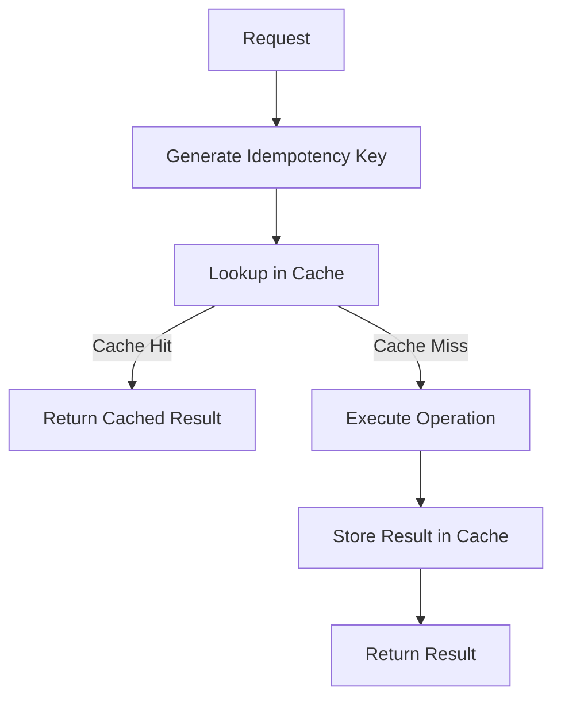

# Idempotency Cache Pattern

## Abstract

The Idempotency Cache pattern ensures that repeated identical requests produce the same result without re-executing the operation. By caching results keyed by a request fingerprint, this pattern prevents duplicate processing, reduces costs, and enables safe retry semantics for non-idempotent operations.

## Problem Statement

In distributed systems, network failures and timeouts can cause clients to retry requests. For non-idempotent operations (those with side effects), retries can cause duplicate processing, data corruption, or unexpected charges. The problem is how to detect duplicate requests and return cached results instead of re-executing.

## Context

This pattern arises when:
- Operations have side effects (create, charge, send)
- Network failures cause request retries
- Clients need exactly-once semantics
- Duplicate processing has real costs
- Request deduplication is needed across instances

## Forces

- **Cache Duration:** Longer cache retains results longer but uses more memory
- **Key Granularity:** Fine-grained keys reduce false matches but increase cache misses
- **Consistency vs. Availability:** Strong consistency requires coordination; eventual consistency may return stale results
- **Memory vs. Storage:** In-memory cache is fast but limited; persistent storage is durable but slower

## Solution

### Architecture Diagram



### Components

- **Idempotency Key Generator:** Creates unique key from request content
- **Cache Store:** Stores request key → result mappings
- **Cache Manager:** Handles TTL, eviction, and cleanup
- **Result Serializer:** Serializes results for cache storage

### Formal Properties

**Invariants:**
- Same request key always returns same cached result
- Cache entry TTL is bounded
- Cache key uniquely identifies request

**Guarantees:**
- Duplicate requests return cached result without re-execution
- Cache miss results in execution and caching
- Cache entries expire after TTL

**Bounds:**
- Cache size: bounded by memory/storage limits
- Cache TTL: bounded by configuration
- Key generation: O(1) time complexity

## Implementation

```typescript
interface IdempotencyConfig {
  ttlMs: number;
  maxSize: number;
  keyGenerator: (request: unknown) => string;
}

class IdempotencyCache<T> {
  private cache = new Map<string, { result: T; timestamp: number }>();
  private config: IdempotencyConfig;

  constructor(config: IdempotencyConfig) {
    this.config = config;
  }

  async execute(
    request: unknown,
    operation: () => Promise<T>
  ): Promise<{ result: T; cached: boolean }> {
    const key = this.config.keyGenerator(request);
    
    // Check cache
    const cached = this.cache.get(key);
    if (cached && Date.now() - cached.timestamp < this.config.ttlMs) {
      return { result: cached.result, cached: true };
    }

    // Execute and cache
    const result = await operation();
    this.cache.set(key, { result, timestamp: Date.now() });
    
    // Evict old entries if needed
    this.evictIfNeeded();
    
    return { result, cached: false };
  }

  private evictIfNeeded(): void {
    if (this.cache.size <= this.config.maxSize) return;
    
    const entries = Array.from(this.cache.entries())
      .sort((a, b) => a[1].timestamp - b[1].timestamp);
    
    const toDelete = entries.slice(0, entries.length - this.config.maxSize);
    toDelete.forEach(([key]) => this.cache.delete(key));
  }
}

// Usage: Idempotent payment processing
const paymentCache = new IdempotencyCache<PaymentResult>({
  ttlMs: 24 * 60 * 60 * 1000, // 24 hours
  maxSize: 10000,
  keyGenerator: (request) => {
    const req = request as PaymentRequest;
    return crypto
      .createHash('sha256')
      .update(`${req.userId}-${req.amount}-${req.recipient}`)
      .digest('hex');
  }
});

// Same payment request will only execute once
const { result, cached } = await paymentCache.execute(paymentRequest, () => 
  processPayment(paymentRequest)
);
```

## Failure Modes

| Failure | Detection | Recovery |
|---------|-----------|----------|
| Cache miss on retry | Operation re-executes | Use persistent cache for critical operations |
| Cache pollution | Memory exhaustion | Implement LRU eviction, size limits |
| Stale cache | TTL too long | Tune TTL based on operation semantics |
| Key collision | Different requests get same key | Improve key generation (include more fields) |

## When NOT to Use

- **Truly idempotent operations:** If operation is already idempotent, cache adds overhead
- **Real-time data:** If results must be current, caching may return stale data
- **Unique results:** If each execution should produce unique result (e.g., unique ID generation)
- **Large results:** If results are very large, cache memory may be exhausted

## Cross-References

### Related Patterns
- **Retry with Backoff** (Part II) — Idempotency cache makes retries safe
- **Circuit Breaker** (Part II) — Cache can serve results when circuit is open
- **Session Management** (Part III) — Session state can include idempotency keys

## References

- **Idempotent REST APIs** — RFC 7231 Section 4.2.2
- **Stripe Idempotency** — Stripe's idempotency key implementation
- **AWS API Gateway** — Idempotency in API Gateway
