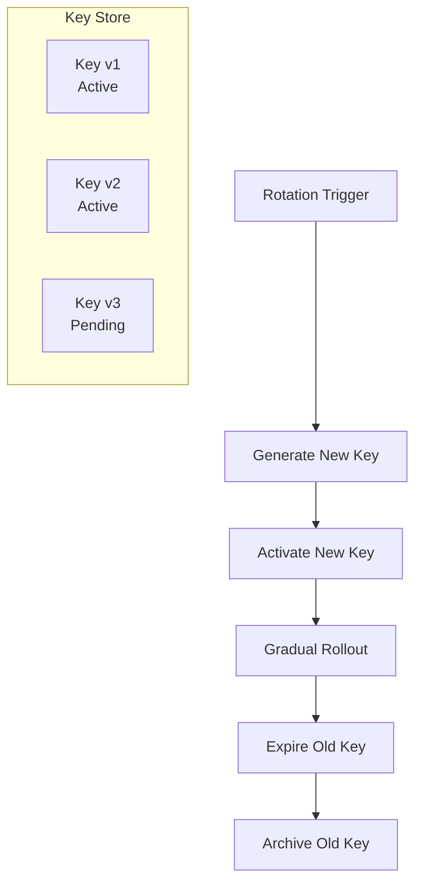

# Multi-Key Rotation Pattern

## Abstract

The Multi-Key Rotation pattern manages cryptographic key lifecycle by maintaining multiple active keys and rotating them on a schedule. By supporting key versioning, gradual rollout, and automatic expiration, this pattern ensures continuous service availability while maintaining security through regular key rotation.

## Problem Statement

Cryptographic keys need regular rotation for security, but rotating keys in production can cause service disruptions if not handled carefully. The problem is how to rotate keys without downtime, support multiple active keys during transition periods, and ensure old keys are properly retired.

## Context

This pattern arises when:
- Cryptographic keys need regular rotation
- Service availability must be maintained during rotation
- Multiple key versions need to coexist
- Key expiration must be enforced
- Audit trails for key usage are required

## Forces

- **Security vs. Availability:** Frequent rotation is more secure but risks availability
- **Gradual vs. Immediate:** Gradual rollout is safer but takes longer
- **Versioning vs. Simplicity:** Key versioning adds complexity but enables smooth rotation
- **Automatic vs. Manual:** Automatic rotation is more reliable but less flexible

## Solution

### Architecture Diagram



### Components

- **Key Manager:** Manages key lifecycle (create, activate, expire)
- **Key Store:** Secure storage for key versions
- **Rotation Scheduler:** Triggers rotation on schedule
- **Rollout Controller:** Manages gradual key rollout
- **Key Validator:** Validates key versions and expiration

### Formal Properties

**Invariants:**
- At least one key is always active
- Expired keys are never used for encryption
- Old keys remain valid for decryption during grace period

**Guarantees:**
- New keys are activated before old keys expire
- All key operations are atomic
- Key rotation completes within bounded time

**Bounds:**
- Active keys: bounded (typically 2-3)
- Key lifetime: bounded by security policy
- Rotation duration: bounded by rollout configuration

## Implementation

```typescript
interface KeyVersion {
  id: string;
  version: number;
  key: CryptoKey;
  createdAt: Date;
  activatedAt?: Date;
  expiresAt: Date;
  status: 'pending' | 'active' | 'expired' | 'revoked';
}

class KeyRotationManager {
  private keys: Map<string, KeyVersion> = new Map();
  private currentVersion: number = 0;
  private gracePeriodMs: number;

  constructor(gracePeriodMs: number = 7 * 24 * 60 * 60 * 1000) { // 7 days
    this.gracePeriodMs = gracePeriodMs;
  }

  async rotate(): Promise<string> {
    // Generate new key
    const newKey = await this.generateKey();
    const newVersion = ++this.currentVersion;
    
    const keyVersion: KeyVersion = {
      id: `key-${newVersion}`,
      version: newVersion,
      key: newKey,
      createdAt: new Date(),
      activatedAt: new Date(),
      expiresAt: new Date(Date.now() + 365 * 24 * 60 * 60 * 1000), // 1 year
      status: 'active',
    };

    this.keys.set(keyVersion.id, keyVersion);

    // Expire old keys (after grace period)
    await this.expireOldKeys();

    return keyVersion.id;
  }

  async encrypt(data: string): Promise<{ keyId: string; encrypted: Uint8Array }> {
    const activeKey = this.getActiveKey();
    if (!activeKey) {
      throw new Error('No active key available');
    }

    const encrypted = await this.encryptWithKey(activeKey.key, data);
    return { keyId: activeKey.id, encrypted };
  }

  async decrypt(keyId: string, encrypted: Uint8Array): Promise<string> {
    const keyVersion = this.keys.get(keyId);
    if (!keyVersion) {
      throw new Error(`Key ${keyId} not found`);
    }

    if (keyVersion.status === 'expired' && Date.now() > keyVersion.expiresAt.getTime() + this.gracePeriodMs) {
      throw new Error(`Key ${keyId} has expired and grace period has passed`);
    }

    return this.decryptWithKey(keyVersion.key, encrypted);
  }

  private getActiveKey(): KeyVersion | null {
    const now = new Date();
    for (const key of this.keys.values()) {
      if (key.status === 'active' && key.expiresAt > now) {
        return key;
      }
    }
    return null;
  }

  private async expireOldKeys(): Promise<void> {
    const now = new Date();
    const activeKeys = Array.from(this.keys.values())
      .filter(k => k.status === 'active')
      .sort((a, b) => b.version - a.version);

    // Keep newest key active, expire others
    if (activeKeys.length > 1) {
      for (const key of activeKeys.slice(1)) {
        key.status = 'expired';
        key.expiresAt = new Date(now.getTime() + this.gracePeriodMs);
      }
    }
  }

  private async generateKey(): Promise<CryptoKey> {
    return crypto.subtle.generateKey(
      { name: 'AES-GCM', length: 256 },
      true,
      ['encrypt', 'decrypt']
    );
  }

  private async encryptWithKey(key: CryptoKey, data: string): Promise<Uint8Array> {
    const iv = crypto.getRandomValues(new Uint8Array(12));
    const encoded = new TextEncoder().encode(data);
    const encrypted = await crypto.subtle.encrypt(
      { name: 'AES-GCM', iv },
      key,
      encoded
    );
    return new Uint8Array([...iv, ...new Uint8Array(encrypted)]);
  }

  private async decryptWithKey(key: CryptoKey, encrypted: Uint8Array): Promise<string> {
    const iv = encrypted.slice(0, 12);
    const data = encrypted.slice(12);
    const decrypted = await crypto.subtle.decrypt(
      { name: 'AES-GCM', iv },
      key,
      data
    );
    return new TextDecoder().decode(decrypted);
  }
}
```

## Failure Modes

| Failure | Detection | Recovery |
|---------|-----------|----------|
| No active key | All keys expired | Emergency key generation |
| Key store unavailable | Connection failure | Use cached keys, fail closed |
| Decryption with expired key | Key past grace period | Return error, require re-encryption |
| Rotation failure | New key generation failed | Retry, alert operations |

## When NOT to Use

- **Single-use keys:** For one-time operations, rotation is unnecessary
- **Non-cryptographic secrets:** For non-crypto secrets, simpler rotation may suffice
- **Offline systems:** If system is offline, use pre-shared keys
- **Hardware security modules:** HSMs may have their own rotation mechanisms

## Cross-References

### Related Patterns
- **API Key Validator** (Part V) — API keys can use rotation pattern
- **Secret Rotation** (Part V) — General secret management
- **Audit Logger** (Part VI) — Log all key rotation events

## References

- **NIST Key Management** — SP 800-57 key management guidelines
- **Google Cloud KMS** — Key rotation best practices
- **AWS KMS** — Automatic key rotation
