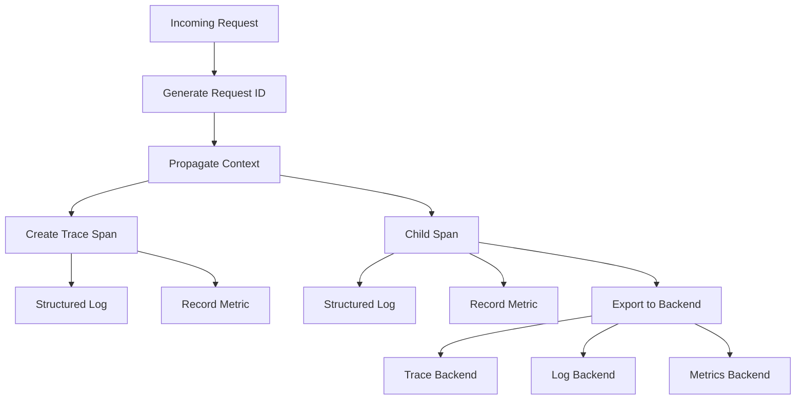

# Observability Pattern

## Abstract

The Observability pattern provides comprehensive visibility into agentic system behavior through structured logging, distributed tracing, and metrics collection. By implementing the three pillars of observability with proper context propagation and PII redaction, this pattern enables debugging, performance analysis, and operational monitoring of complex multi-agent systems.

## Problem Statement

Distributed agentic systems involve multiple components (classifiers, routers, agents, databases) that must work together. The problem is how to gain visibility into system behavior across service boundaries, correlate events from different components, and debug issues without instrumenting every line of code.

## Context

This pattern arises when:
- Multiple services interact in a request flow
- Debugging requires understanding the full request path
- Performance bottlenecks need to be identified
- Operational monitoring requires real-time metrics
- Compliance requires audit trails

## Forces

- **Detail vs. Overhead:** Detailed telemetry is useful but adds overhead
- **Sampling vs. Completeness:** Sampling reduces cost but may miss rare issues
- **Standardization vs. Flexibility:** Standards enable tooling but limit customization
- **Real-time vs. Batch:** Real-time is immediate but expensive; batch is cheaper but delayed

## Solution

### Architecture Diagram



### Components

- **Context Propagator:** Propagates request ID and trace context across services
- **Tracer:** Creates and manages distributed trace spans
- **Logger:** Produces structured JSON logs with context
- **Metrics Collector:** Records and exports metrics
- **PII Redactor:** Removes sensitive data from telemetry

### Formal Properties

**Invariants:**
- Every request has a unique identifier
- Trace context is propagated across service boundaries
- PII is never logged in plaintext

**Guarantees:**
- All spans in a trace are linked by trace ID
- Logs include request ID for correlation
- Metrics are recorded with consistent labels

**Bounds:**
- Trace depth: bounded to prevent stack overflow
- Log size: bounded per entry
- Metric cardinality: bounded to prevent explosion

## Implementation

```typescript
import { trace, Span, SpanStatusCode } from '@opentelemetry/api';
import { metrics } from '@opentelemetry/sdk-metrics';

interface LogContext {
  requestId: string;
  sessionId?: string;
  userId?: string;
  agentId?: string;
  traceId: string;
  spanId: string;
}

class ObservabilityManager {
  private logger: Logger;
  private tracer: Tracer;
  private meter: Meter;
  private piiPatterns: RegExp[];

  constructor(config: ObservabilityConfig) {
    this.logger = this.createLogger(config);
    this.tracer = trace.getTracer('agentic-system', config.version);
    this.meter = metrics.getMeter('agentic-system', config.version);
    
    this.piiPatterns = [
      /\b\d{3}-\d{2}-\d{4}\b/, // SSN
      /\b\d{16}\b/, // Credit card
      // ... more patterns
    ];

    // Create metrics
    this.requestCounter = this.meter.createCounter('requests.total', {
      description: 'Total number of requests',
    });
    
    this.requestDuration = this.meter.createHistogram('request.duration_ms', {
      description: 'Request duration in milliseconds',
    });
  }

  async handleRequest<T>(
    name: string,
    handler: () => Promise<T>,
    context: LogContext
  ): Promise<T> {
    const startTime = Date.now();
    
    // Create trace span
    const span = this.tracer.startSpan(name, {
      attributes: {
        'request.id': context.requestId,
        'session.id': context.sessionId,
        'agent.id': context.agentId,
      },
    });

    try {
      // Execute handler
      const result = await handler();
      
      // Record success
      span.setStatus({ code: SpanStatusCode.OK });
      this.requestCounter.add(1, { status: 'success', name });
      
      return result;
    } catch (error) {
      // Record error
      span.recordException(error);
      span.setStatus({ code: SpanStatusCode.ERROR });
      this.requestCounter.add(1, { status: 'error', name });
      throw error;
    } finally {
      // Record duration
      const duration = Date.now() - startTime;
      this.requestDuration.record(duration, { name });
      
      // Log completion
      this.logger.info({
        ...context,
        action: name,
        duration_ms: duration,
        status: span.status?.code === SpanStatusCode.OK ? 'success' : 'error',
      }, 'Request completed');
      
      span.end();
    }
  }

  log(level: 'debug' | 'info' | 'warn' | 'error', message: string, context: LogContext, data?: Record<string, unknown>): void {
    const logData = this.redactPII(data || {});
    
    this.logger[level]({
      ...context,
      ...logData,
    }, message);
  }

  private redactPII(data: Record<string, unknown>): Record<string, unknown> {
    const json = JSON.stringify(data);
    const redacted = this.piiPatterns.reduce(
      (acc, pattern) => acc.replace(pattern, '[REDACTED]'),
      json
    );
    return JSON.parse(redacted);
  }
}

// Usage
const observability = new ObservabilityManager({
  version: '1.0.0',
  service: 'orchestrator-core',
  otlpEndpoint: process.env.OTEL_EXPORTER_OTLP_ENDPOINT,
});

// Wrap request handler
app.post('/v1/request', async (req, res) => {
  const context: LogContext = {
    requestId: generateRequestId(),
    traceId: trace.getActiveSpan()?.spanContext().traceId || '',
    spanId: trace.getActiveSpan()?.spanContext().spanId || '',
  };

  await observability.handleRequest('handle_request', async () => {
    // Process request
    const result = await processRequest(req.body);
    
    observability.log('info', 'Request processed', context, {
      agent_id: result.agentId,
      confidence: result.confidence,
    });
    
    return result;
  }, context);
});
```

## Failure Modes

| Failure | Detection | Recovery |
|---------|-----------|----------|
| Tracing backend unavailable | Connection timeout | Buffer spans locally, retry |
| Log buffer full | Buffer overflow | Drop oldest logs, alert |
| High cardinality metrics | Memory growth | Limit label values, aggregate |
| Context propagation failure | Missing trace ID | Generate new trace, log warning |

## When NOT to Use

- **Simple single-service apps:** Observability overhead may not be justified
- **Development environments:** Full observability adds complexity in dev
- **Performance-critical paths:** Sampling may be needed for hot paths
- **Cost-sensitive:** Observability backends can be expensive at scale

## Cross-References

### Related Patterns
- **Audit Logger** (Part VI) — Audit logs are a form of observability
- **Health Check** (Part VI) — Health metrics feed into observability
- **Circuit Breaker** (Part II) — Circuit breaker state is exposed as metrics

### External Implementations
- **agent-mesh** — `src/observability/` with OTel integration

## References

- **OpenTelemetry** — Industry standard for observability
- **Google SRE** — Four Golden Signals (latency, traffic, errors, saturation)
- **Distributed Tracing** — OpenTracing and OpenCensus standards
- **Structured Logging** — Best practices for log formatting
