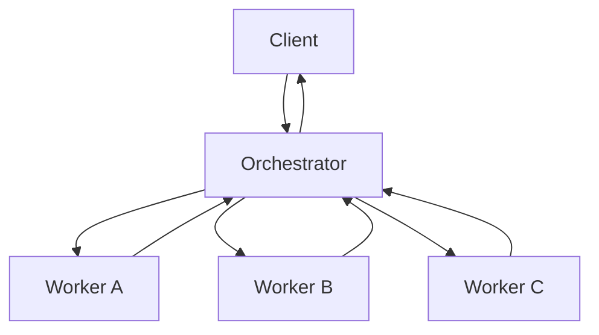

# Orchestrator-Worker Pattern

## Abstract

The Orchestrator-Worker pattern coordinates task distribution among specialized agents. A central orchestrator receives requests, decomposes them into subtasks, and dispatches work to worker agents based on their capabilities. Workers execute their assigned tasks and return results to the orchestrator, which aggregates responses and produces the final output.

## Problem Statement

In multi-agent systems, requests often require capabilities that span multiple domains. A single monolithic agent becomes unmaintainable as the number of tools and capabilities grows. The problem is how to coordinate specialized agents to handle complex requests while maintaining separation of concerns, enabling independent scaling, and providing clear failure boundaries.

## Context

This pattern arises when:
- Multiple specialized agents exist, each with distinct capabilities
- Requests may require coordination across multiple agents
- Different agents have different performance characteristics
- Independent scaling of agent types is desired
- Clear ownership and responsibility boundaries are needed

## Forces

- **Specialization vs. Coordination:** Specialized agents are more maintainable but require coordination overhead
- **Latency vs. Quality:** Sequential orchestration adds latency but enables quality control
- **Coupling vs. Flexibility:** Tight coupling simplifies coordination but reduces flexibility
- **State Management:** Orchestrator must track worker state without becoming a bottleneck

## Solution

### Architecture Diagram



### Components

- **Orchestrator:** Receives client requests, decomposes into subtasks, dispatches to workers, aggregates results
- **Worker:** Specialized agent that executes assigned subtasks and returns results
- **Task Queue:** Optional buffer between orchestrator and workers for load balancing
- **Result Store:** Optional persistent storage for worker results

### Interaction Sequence

1. Client sends request to orchestrator
2. Orchestrator parses request and identifies required capabilities
3. Orchestrator creates subtasks for each required capability
4. Orchestrator dispatches subtasks to appropriate workers
5. Workers execute subtasks independently
6. Workers return results to orchestrator
7. Orchestrator aggregates results
8. Orchestrator returns final response to client

### Formal Properties

**Invariants:**
- Each subtask is assigned to exactly one worker
- Orchestrator tracks all pending subtasks
- Results are correlated with their originating subtasks

**Guarantees:**
- All subtasks are eventually executed or explicitly cancelled
- Client receives aggregated response within bounded time
- Worker failures are isolated and do not affect other workers

**Bounds:**
- Maximum subtasks per request: configurable
- Worker timeout: bounded by orchestrator timeout
- Result aggregation: O(n) where n = number of subtasks

## Implementation

### TypeScript Example

```typescript
import { z } from 'zod';
import pino from 'pino';

const logger = pino();

// Subtask definition
interface Subtask {
  id: string;
  workerId: string;
  input: unknown;
  status: 'pending' | 'running' | 'completed' | 'failed';
  result?: unknown;
  error?: Error;
}

// Worker interface
interface Worker {
  id: string;
  capabilities: string[];
  execute(input: unknown): Promise<unknown>;
}

// Orchestrator implementation
class Orchestrator {
  private workers = new Map<string, Worker>();
  private subtasks = new Map<string, Subtask>();

  registerWorker(worker: Worker): void {
    this.workers.set(worker.id, worker);
    logger.info({ workerId: worker.id, capabilities: worker.capabilities }, 'Worker registered');
  }

  async execute(request: { id: string; type: string; input: unknown }): Promise<unknown> {
    const subtasks = this.decompose(request);
    
    // Dispatch subtasks to workers
    const results = await Promise.allSettled(
      subtasks.map(subtask => this.executeSubtask(subtask))
    );

    // Aggregate results
    return this.aggregate(request, results);
  }

  private decompose(request: { id: string; type: string; input: unknown }): Subtask[] {
    // Pattern-specific decomposition logic
    const subtasks: Subtask[] = [];
    
    // Example: decompose based on request type
    switch (request.type) {
      case 'multi-step':
        subtasks.push({
          id: `${request.id}-1`,
          workerId: 'worker-a',
          input: request.input,
          status: 'pending'
        });
        subtasks.push({
          id: `${request.id}-2`,
          workerId: 'worker-b',
          input: request.input,
          status: 'pending'
        });
        break;
      default:
        subtasks.push({
          id: `${request.id}-1`,
          workerId: 'default-worker',
          input: request.input,
          status: 'pending'
        });
    }
    
    return subtasks;
  }

  private async executeSubtask(subtask: Subtask): Promise<Subtask> {
    const worker = this.workers.get(subtask.workerId);
    if (!worker) {
      subtask.status = 'failed';
      subtask.error = new Error(`Worker ${subtask.workerId} not found`);
      return subtask;
    }

    subtask.status = 'running';
    this.subtasks.set(subtask.id, subtask);

    try {
      const result = await worker.execute(subtask.input);
      subtask.status = 'completed';
      subtask.result = result;
    } catch (error) {
      subtask.status = 'failed';
      subtask.error = error as Error;
    }

    return subtask;
  }

  private aggregate(request: { id: string }, results: PromiseSettledResult<Subtask>[]): unknown {
    const completed = results.filter(r => r.status === 'fulfilled' && r.value.status === 'completed');
    const failed = results.filter(r => r.status === 'rejected' || r.value.status === 'failed');

    logger.info({
      requestId: request.id,
      total: results.length,
      completed: completed.length,
      failed: failed.length
    }, 'Subtask aggregation complete');

    return {
      requestId: request.id,
      results: results.map(r => r.status === 'fulfilled' ? r.value : { error: 'failed' }),
      success: failed.length === 0
    };
  }
}

// Usage
const orchestrator = new Orchestrator();
orchestrator.registerWorker({
  id: 'worker-a',
  capabilities: ['capability-1'],
  execute: async (input) => { /* worker logic */ return { result: 'A' }; }
});
```

### Key Design Decisions

- **Synchronous vs. Asynchronous:** Synchronous for simplicity; asynchronous for scalability
- **Decomposition Strategy:** Rule-based decomposition for predictability; ML-based for flexibility
- **Result Aggregation:** Simple concatenation for homogeneous results; custom logic for heterogeneous

## Failure Modes

| Failure | Detection | Recovery |
|---------|-----------|----------|
| Worker unavailable | Timeout or connection error | Retry with backoff, failover to backup worker |
| Subtask timeout | Timeout exceeded | Cancel subtask, return partial results or error |
| Result aggregation failure | Exception during aggregation | Return raw results with aggregation error |
| Orchestrator failure | Health check failure | Failover to backup orchestrator |
| Worker returns invalid result | Schema validation failure | Retry or mark as failed |

## When NOT to Use

- **Simple requests:** If requests can be handled by a single agent, avoid orchestration overhead
- **Tight latency requirements:** Sequential orchestration adds latency; consider parallel execution
- **Stateful workflows:** If workflow state must persist across requests, consider Saga pattern
- **Highly coupled tasks:** If tasks are highly interdependent, consider Pipeline pattern

## Cross-References

### Related Patterns
- **Supervisor** (Part I) — Adds hierarchical oversight and escalation
- **Fan-Out/Fan-In** (Part I) — Parallel execution variant
- **Pipeline** (Part I) — Sequential processing variant
- **Router** (Part I) — Content-based routing to workers

### External Implementations
- **agent-mesh** — Complete orchestrator implementation with confidence gating

## References

- **Pattern-Oriented Software Architecture, Volume 1** (Buschmann et al., 1996) — Master-Slave pattern
- **Enterprise Integration Patterns** (Hohpe & Woolf, 2003) — Message routing patterns
- **Building Microservices** (Newman, 2015) — Service orchestration vs. choreography
