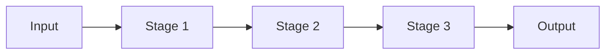

# Pipeline Pattern

## Abstract

The Pipeline pattern chains sequential transformations where each stage processes input and passes output to the next stage. In agentic systems, this enables modular processing where different agents handle different transformation stages, with clear data flow and separation of concerns.

## Problem Statement

Complex request processing often requires multiple transformation steps. Monolithic processing is difficult to maintain, test, and scale. The problem is how to decompose processing into modular stages with clear interfaces while maintaining data flow efficiency and enabling independent stage optimization.

## Context

This pattern arises when:
- Processing requires multiple sequential transformations
- Each transformation has distinct logic and requirements
- Stages can be developed and deployed independently
- Data flows linearly through the system
- Intermediate results may need inspection or caching

## Forces

- **Modularity vs. Latency:** More stages improve modularity but add latency
- **Coupling vs. Flexibility:** Tight coupling simplifies data passing but reduces flexibility
- **State vs. Statelessness:** Stateful stages enable optimization but complicate recovery
- **Synchronous vs. Asynchronous:** Sync is simpler but async enables better resource utilization

## Solution

### Architecture Diagram



### Components

- **Stage:** Processing unit that transforms input to output
- **Pipeline:** Ordered sequence of stages with data flow
- **Buffer:** Optional queue between stages for load balancing
- **Collector:** Aggregates final output from last stage

### Formal Properties

**Invariants:**
- Each stage receives input from exactly one predecessor
- Each stage sends output to exactly one successor
- Data flows in one direction (no cycles)

**Guarantees:**
- All stages process data in order
- Stage failures are isolated and do not corrupt data
- Pipeline produces output within bounded time

**Bounds:**
- Pipeline latency: sum of stage latencies
- Buffer size: bounded to prevent memory exhaustion
- Stage throughput: bounded by slowest stage

## Implementation

```typescript
interface PipelineStage<T, U> {
  name: string;
  process(input: T): Promise<U>;
}

class Pipeline<T> {
  private stages: PipelineStage<unknown, unknown>[] = [];

  addStage<U, V>(stage: PipelineStage<U, V>): Pipeline<V> {
    this.stages.push(stage as PipelineStage<unknown, unknown>);
    return this as unknown as Pipeline<V>;
  }

  async execute(input: T): Promise<unknown> {
    let current = input;
    for (const stage of this.stages) {
      current = await stage.process(current);
    }
    return current;
  }
}

// Usage
const pipeline = new Pipeline<string>()
  .addStage({ name: 'parse', process: (input: string) => JSON.parse(input) })
  .addStage({ name: 'validate', process: (input: object) => validate(input) ? input : null })
  .addStage({ name: 'enrich', process: (input: object) => ({ ...input, timestamp: Date.now() }) });
```

## Failure Modes

| Failure | Detection | Recovery |
|---------|-----------|----------|
| Stage timeout | Processing exceeds timeout | Skip stage, use default, or fail pipeline |
| Stage returns invalid data | Schema validation failure | Retry, use fallback, or fail pipeline |
| Buffer overflow | Queue depth exceeds limit | Backpressure, drop data, or fail |
| Stage crash | Process termination | Restart stage, skip, or fail pipeline |

## When NOT to Use

- **Non-linear processing:** If processing branches or merges, consider Fan-Out/Fan-In
- **Feedback loops:** If later stages affect earlier stages, consider iterative patterns
- **Stateful workflows:** If state must persist across requests, consider Saga
- **Simple processing:** For simple transformations, pipeline overhead is unnecessary

## Cross-References

### Related Patterns
- **Orchestrator-Worker** (Part I) — Parallel instead of sequential
- **Fan-Out/Fan-In** (Part I) — Parallel processing variant
- **Saga** (Part III) — Transactional pipeline with rollback

## References

- **Enterprise Integration Patterns** (Hohpe & Woolf, 2003) — Pipes and Filters pattern
- **Unix Philosophy** (McIlroy, 1978) — Do one thing well, compose with pipes
