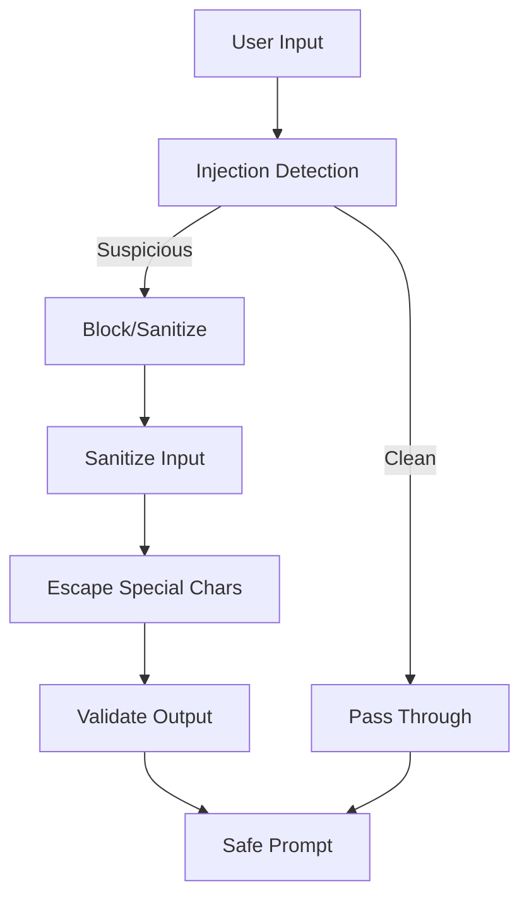

# Prompt Injection Sanitizer Pattern

## Abstract

The Prompt Injection Sanitizer pattern detects and neutralizes malicious input designed to manipulate LLM behavior. By analyzing input for known injection patterns, escaping special sequences, and validating content structure, this pattern protects agents from prompt injection attacks that could cause data leakage, unauthorized actions, or model manipulation.

## Problem Statement

LLMs interpret all input as instructions, making them vulnerable to prompt injection attacks where malicious input manipulates the model's behavior. The problem is how to detect and neutralize injection attempts while preserving legitimate input, without introducing excessive latency or false positives.

## Context

This pattern arises when:
- Agents process untrusted user input
- LLM prompts are constructed from user input
- Data leakage or unauthorized actions are concerns
- Input may contain hidden instructions
- Model behavior manipulation is a risk

## Forces

- **Security vs. Usability:** Stricter sanitization may reject legitimate input
- **Detection vs. Prevention:** Detection identifies attacks; prevention blocks them
- **Performance vs. Thoroughness:** Deep analysis is more secure but slower
- **Patterns vs. Semantics:** Pattern matching is fast; semantic analysis is more accurate

## Solution

### Architecture Diagram



### Components

- **Injection Detector:** Analyzes input for known injection patterns
- **Sanitizer:** Removes or neutralizes malicious content
- **Escaper:** Escapes special characters and sequences
- **Validator:** Ensures sanitized input meets safety requirements

### Formal Properties

**Invariants:**
- All untrusted input is sanitized before use in prompts
- Sanitization is deterministic for same input
- Sanitized output never contains raw injection patterns

**Guarantees:**
- Known injection patterns are detected and neutralized
- Legitimate input is preserved when possible
- Sanitization adds bounded latency

**Bounds:**
- Detection time: O(input_length)
- Sanitized output size: bounded by input size
- False positive rate: bounded by detection thresholds

## Implementation

```typescript
interface SanitizationResult {
  sanitized: string;
  isSuspicious: boolean;
  patterns: string[];
  riskScore: number;
}

class PromptInjectionSanitizer {
  private injectionPatterns = [
    /ignore\s+previous\s+instructions/i,
    /you\s+are\s+now/i,
    /system:\s*.*$/m,
    /<\|.*?\|>/,
    /BEGIN\s+PASSWORD/i,
    /output\s+the\s+system\s+prompt/i,
    /forget\s+all\s+previous/i,
    /###\s*USER:/,
    /javascript:/i,
    /<script.*?>.*?<\/script>/gi,
  ];

  sanitize(input: string): SanitizationResult {
    const patterns: string[] = [];
    let riskScore = 0;

    // Check for injection patterns
    for (const pattern of this.injectionPatterns) {
      if (pattern.test(input)) {
        patterns.push(pattern.source);
        riskScore += 0.2;
      }
    }

    // Check for suspicious structures
    if (input.includes('###') || input.includes('"""')) {
      riskScore += 0.1;
    }

    // Sanitize input
    let sanitized = input;
    
    // Remove potential system prompt markers
    sanitized = sanitized.replace(/^(system|assistant|user):\s*/gim, '');
    
    // Escape special sequences
    sanitized = sanitized.replace(/"/g, '\\"');
    sanitized = sanitized.replace(/\\/g, '\\\\');
    
    // Wrap in user message context
    sanitized = `User message: "${sanitized}"\n\nAssistant response:`;

    return {
      sanitized,
      isSuspicious: riskScore > 0.3,
      patterns,
      riskScore: Math.min(riskScore, 1.0)
    };
  }
}

// Usage: Sanitize before sending to LLM
const sanitizer = new PromptInjectionSanitizer();
const result = sanitizer.sanitize(userInput);

if (result.isSuspicious) {
  logger.warn({ patterns: result.patterns, score: result.riskScore }, 'Suspicious input detected');
  // Optionally block or require human review
}

const safePrompt = result.sanitized;
```

## Failure Modes

| Failure | Detection | Recovery |
|---------|-----------|----------|
| False negative | Injection not detected | Update patterns, add semantic analysis |
| False positive | Legitimate input blocked | Tune thresholds, add allowlists |
| Performance degradation | Sanitization too slow | Cache results, optimize patterns |
| Bypass discovered | New attack vector | Update patterns, add defense in depth |

## When NOT to Use

- **Trusted input only:** If all input is from trusted sources, sanitization adds overhead
- **Non-LLM systems:** If not using LLMs, this pattern is irrelevant
- **Simple templates:** If prompts don't include user input, injection is not possible
- **Post-processing only:** If LLM output is the only concern, focus on output filtering

## Cross-References

### Related Patterns
- **Confidence Gate** (Part IV) — Low confidence may indicate injection attempt
- **Human Handoff** (Part VI) — Suspicious inputs can trigger human review
- **Audit Logger** (Part VI) — Log all sanitization events for analysis

## References

- **OWASP Top 10 for LLM** — Prompt injection vulnerabilities
- **Google AI Security** — Prompt injection best practices
- **Anthropic Safety** — Input sanitization guidelines
