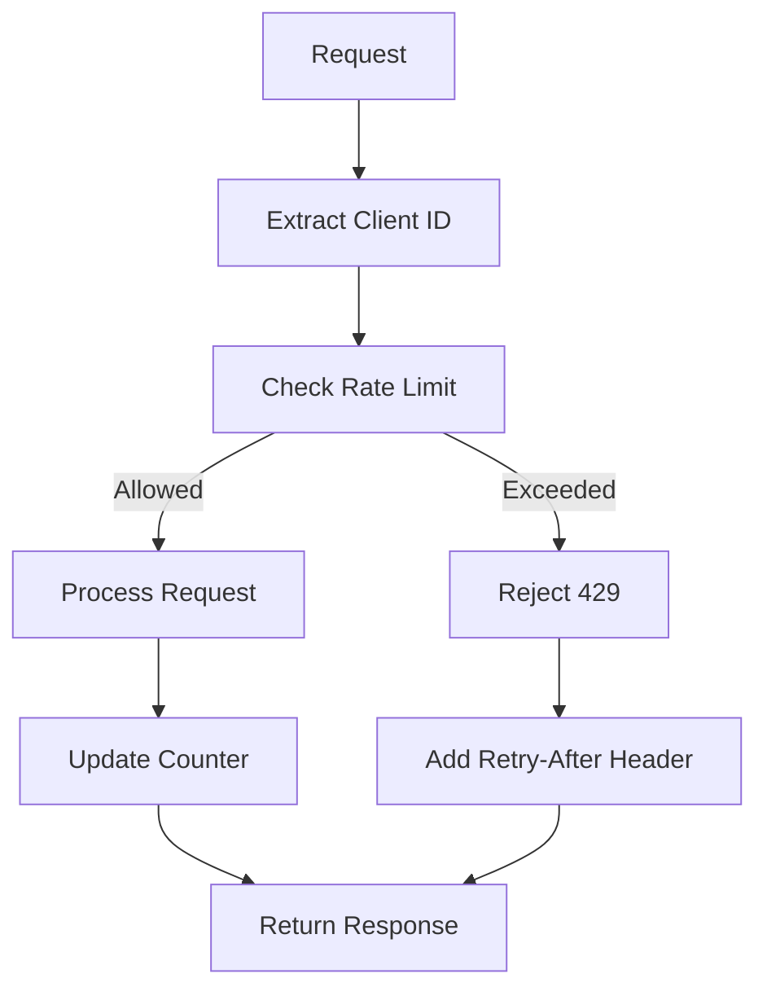

# Rate Limiter Pattern

## Abstract

The Rate Limiter pattern controls the rate of requests to prevent resource exhaustion and ensure fair usage. By implementing token bucket or sliding window algorithms with per-client tracking, this pattern protects agent services from abuse while allowing legitimate traffic to flow smoothly.

## Problem Statement

Agent services have finite resources and need protection from request floods, whether accidental or malicious. The problem is how to limit request rates per client while allowing bursts, handling distributed deployments, and providing clear feedback when limits are exceeded.

## Context

This pattern arises when:
- Services need protection from request floods
- Fair usage among clients is required
- API costs need to be controlled
- Resource exhaustion is a concern
- Graceful degradation under load is needed

## Forces

- **Strictness vs. Flexibility:** Strict limits protect resources but may block legitimate traffic
- **Per-client vs. Global:** Per-client limits are fair; global limits are simpler
- **Burst vs. Sustained:** Allowing bursts improves UX but complicates implementation
- **Local vs. Distributed:** Local limiting is fast; distributed is consistent

## Solution

### Architecture Diagram



### Components

- **Client Identifier:** Extracts client ID from request (API key, IP, user ID)
- **Rate Counter:** Tracks request count per client
- **Limit Evaluator:** Determines if request is within limits
- **Response Handler:** Adds rate limit headers to responses

### Formal Properties

**Invariants:**
- Every request is counted against the client's limit
- Limits are enforced consistently across instances
- Expired counters are cleaned up

**Guarantees:**
- Clients cannot exceed their configured limits
- Burst capacity is available within window
- Clear feedback is provided when limits are exceeded

**Bounds:**
- Window size: bounded (typically 1 second to 1 minute)
- Max requests per window: bounded by configuration
- Counter storage: bounded by active client count

## Implementation

```typescript
interface RateLimitConfig {
  windowMs: number;
  maxRequests: number;
  burstCapacity?: number;
}

interface RateLimitResult {
  allowed: boolean;
  remaining: number;
  resetAt: number;
  retryAfter?: number;
}

class TokenBucketRateLimiter {
  private buckets = new Map<string, { tokens: number; lastRefill: number }>();
  private config: RateLimitConfig;

  constructor(config: RateLimitConfig) {
    this.config = config;
  }

  checkLimit(clientId: string): RateLimitResult {
    const now = Date.now();
    const bucket = this.buckets.get(clientId) || {
      tokens: this.config.maxRequests,
      lastRefill: now,
    };

    // Refill tokens based on elapsed time
    const elapsed = now - bucket.lastRefill;
    const tokensToAdd = (elapsed / this.config.windowMs) * this.config.maxRequests;
    bucket.tokens = Math.min(
      bucket.tokens + tokensToAdd,
      this.config.maxRequests + (this.config.burstCapacity || 0)
    );
    bucket.lastRefill = now;

    const resetAt = now + this.config.windowMs;

    if (bucket.tokens >= 1) {
      bucket.tokens -= 1;
      this.buckets.set(clientId, bucket);

      return {
        allowed: true,
        remaining: Math.floor(bucket.tokens),
        resetAt,
      };
    } else {
      this.buckets.set(clientId, bucket);

      const retryAfter = Math.ceil((1 - bucket.tokens) / this.config.maxRequests * this.config.windowMs / 1000);

      return {
        allowed: false,
        remaining: 0,
        resetAt,
        retryAfter,
      };
    }
  }

  // Cleanup expired buckets periodically
  cleanup(): void {
    const now = Date.now();
    for (const [clientId, bucket] of this.buckets.entries()) {
      if (now - bucket.lastRefill > this.config.windowMs * 2) {
        this.buckets.delete(clientId);
      }
    }
  }
}

// Middleware usage
const limiter = new TokenBucketRateLimiter({
  windowMs: 60 * 1000, // 1 minute
  maxRequests: 100,    // 100 requests per minute
  burstCapacity: 20,   // Allow 20 extra for bursts
});

app.use((req, res, next) => {
  const clientId = req.headers['x-api-key'] as string || req.ip;
  const result = limiter.checkLimit(clientId);

  // Add rate limit headers
  res.set('X-RateLimit-Limit', result.remaining + (result.allowed ? 0 : 1));
  res.set('X-RateLimit-Remaining', result.remaining);
  res.set('X-RateLimit-Reset', result.resetAt.toString());

  if (!result.allowed) {
    res.set('Retry-After', result.retryAfter!.toString());
    return res.status(429).json({ error: 'Rate limit exceeded' });
  }

  next();
});
```

## Failure Modes

| Failure | Detection | Recovery |
|---------|-----------|----------|
| Memory exhaustion | Too many client buckets | Implement LRU eviction, use external store |
| Clock skew | Distributed instances disagree | Use synchronized time source |
| Client ID spoofing | Same client uses multiple IDs | Use authenticated client IDs |
| False positives | Legitimate traffic blocked | Tune limits, add allowlists |

## When NOT to Use

- **Internal services:** If all clients are trusted, rate limiting adds overhead
- **Low-traffic services:** If traffic is consistently low, limiting is unnecessary
- **Batch processing:** For batch jobs, use quotas instead of rate limits
- **Real-time systems:** For real-time systems, use admission control instead

## Cross-References

### Related Patterns
- **API Key Validator** (Part V) — Rate limit per API key
- **Circuit Breaker** (Part II) — Both protect against overload
- **Load Shedder** (Part II) — Rate limiting is a form of load shedding

### External Implementations
- **agent-mesh** — `src/gateway/rateLimiter.middleware.ts` with token bucket

## References

- **Rate Limiting Best Practices** — OWASP guidelines
- **Token Bucket Algorithm** — Classic rate limiting algorithm
- **Google Cloud API Quotas** — Cloud rate limiting implementation
