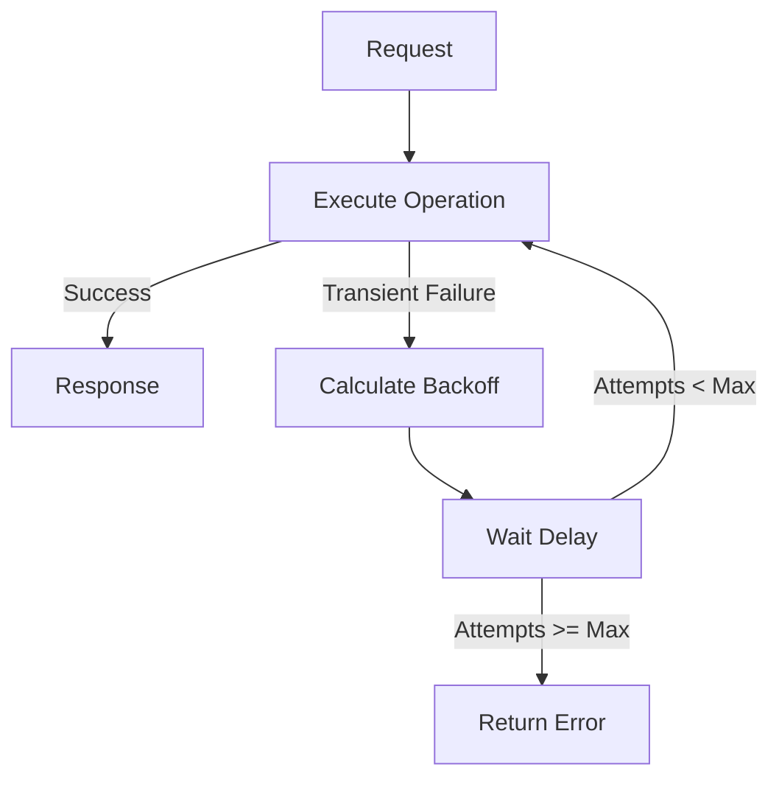

# Retry with Backoff Pattern

## Abstract

The Retry with Backoff pattern handles transient failures by retrying failed operations with exponentially increasing delays between attempts. This pattern gracefully handles temporary issues like network glitches, rate limits, and brief service disruptions without overwhelming the recovering service.

## Problem Statement

Transient failures are common in distributed systems but often resolve quickly. Immediate retry can overwhelm recovering services and waste resources. The problem is how to retry failed operations effectively while giving the service time to recover and avoiding thundering herd problems.

## Context

This pattern arises when:
- Failures are often transient and self-resolving
- Services may be temporarily overloaded
- Rate limits need to be respected
- Network issues cause occasional failures
- Immediate retry would be counterproductive

## Forces

- **Speed vs. Patience:** Quick retries resolve fast but may overwhelm services
- **Determinism vs. Randomness:** Fixed backoff is predictable; jitter prevents synchronization
- **Max Retries vs. Latency:** More retries improve success rate but increase worst-case latency
- **Retry All vs. Selective:** Retry all failures vs. only known transient errors

## Solution

### Architecture Diagram



### Components

- **Retry Executor:** Manages retry loop and attempt tracking
- **Backoff Calculator:** Computes delay based on attempt number
- **Jitter Generator:** Adds randomness to prevent synchronization
- **Error Classifier:** Distinguishes transient from permanent failures

### Formal Properties

**Invariants:**
- Delay increases monotonically with attempt number
- Total retry time is bounded
- Only transient errors trigger retries

**Guarantees:**
- Operation is retried up to max_attempts times
- Delay between retries follows exponential backoff
- Jitter prevents thundering herd

**Bounds:**
- Max retries: configurable (typically 3-5)
- Max delay: bounded by backoff cap
- Total retry time: O(2^max_retries)

## Implementation

```typescript
interface RetryConfig {
  maxAttempts: number;
  initialDelayMs: number;
  maxDelayMs: number;
  backoffMultiplier: number;
  jitter: boolean;
}

async function retryWithBackoff<T>(
  operation: () => Promise<T>,
  config: RetryConfig,
  isTransient: (error: Error) => boolean = () => true
): Promise<T> {
  let lastError: Error;
  let delay = config.initialDelayMs;

  for (let attempt = 0; attempt < config.maxAttempts; attempt++) {
    try {
      return await operation();
    } catch (error) {
      lastError = error as Error;
      
      if (!isTransient(lastError) || attempt === config.maxAttempts - 1) {
        throw lastError;
      }

      // Calculate delay with optional jitter
      let actualDelay = delay;
      if (config.jitter) {
        actualDelay = delay * (0.5 + Math.random() * 0.5);
      }

      await sleep(actualDelay);
      delay = Math.min(delay * config.backoffMultiplier, config.maxDelayMs);
    }
  }

  throw lastError!;
}

function sleep(ms: number): Promise<void> {
  return new Promise(resolve => setTimeout(resolve, ms));
}
```

## Failure Modes

| Failure | Detection | Recovery |
|---------|-----------|----------|
| Retry storm | Exponential traffic increase | Add jitter, reduce max attempts |
| Permanent failure retried | Same error on every attempt | Improve error classification |
| Timeout exceeded | Total retry time > SLA | Reduce max attempts or initial delay |
| Resource exhaustion | Memory/CPU spike during retries | Add concurrency limits |

## When NOT to Use

- **Non-idempotent operations:** If operation has side effects, retry may cause duplication
- **Real-time requirements:** Retry adds unpredictable latency
- **Permanent failures:** If failure is clearly permanent, fail immediately
- **Stateful connections:** If connection state is lost, need reconnection logic instead

## Cross-References

### Related Patterns
- **Circuit Breaker** (Part II) — Circuit breaker prevents retry to unhealthy services
- **Timeout** (Part II) — Each retry attempt should have a timeout
- **Idempotency Cache** (Part III) — Makes retries safe for non-idempotent operations

## References

- **Release It!** (Nygard, 2007) — Retry patterns
- **AWS Architecture Center** — Exponential backoff best practices
- **Google Cloud Best Practices** — Error handling and retry strategies
