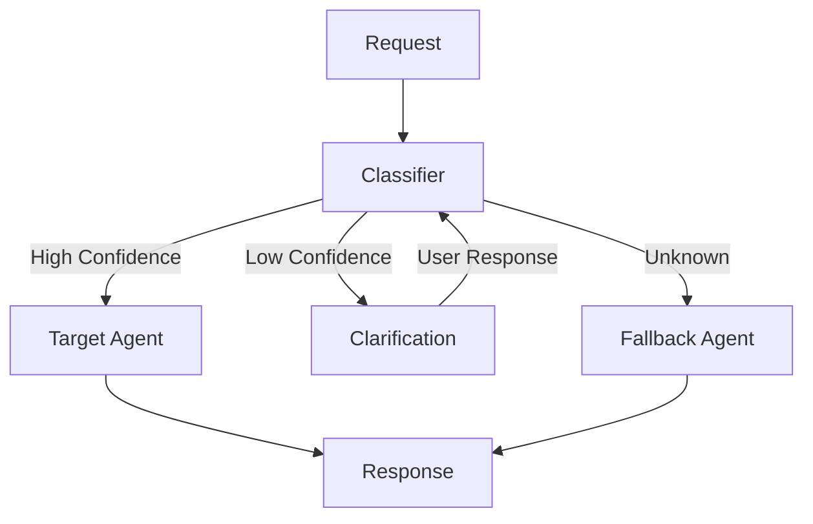

# Router Pattern

## Abstract

The Router pattern directs requests to appropriate agents based on content analysis. Using intent classification and entity extraction, the router determines which specialized agent is best suited to handle each request, enabling separation of concerns and optimal resource utilization.

## Problem Statement

In multi-agent systems, different agents specialize in different domains. Requests arrive without explicit routing information, requiring intelligent classification to direct them to the appropriate agent. The problem is how to accurately classify requests and route them to the best-suited agent while handling ambiguity and maintaining low latency.

## Context

This pattern arises when:
- Multiple specialized agents exist with different capabilities
- Requests arrive without explicit agent targeting
- Request content determines the appropriate agent
- Ambiguous requests need clarification or fallback
- Routing decisions must be made quickly

## Forces

- **Accuracy vs. Latency:** More sophisticated classification improves accuracy but increases latency
- **Specificity vs. Coverage:** Specialized agents are accurate but may miss edge cases
- **Static vs. Dynamic:** Static routing is predictable; dynamic routing adapts to conditions
- **Confidence Threshold:** High threshold causes more fallbacks; low threshold causes misrouting

## Solution

### Architecture Diagram



### Components

- **Classifier:** Analyzes request content and determines intent
- **Router:** Maps intent to appropriate agent based on configuration
- **Agent Registry:** Configuration of agents and their capabilities
- **Clarification Generator:** Generates questions for ambiguous requests
- **Fallback Agent:** Handles requests that cannot be classified

### Formal Properties

**Invariants:**
- Every request is routed to exactly one agent
- Classification is deterministic for same input
- Fallback agent always available for unclassified requests

**Guarantees:**
- Requests above confidence threshold route to intended agent
- Ambiguous requests trigger clarification
- Unclassifiable requests route to fallback agent

**Bounds:**
- Classification latency: bounded by model inference time
- Router decision: O(1) after classification
- Clarification rounds: bounded to prevent loops

## Implementation

```typescript
interface AgentConfig {
  id: string;
  capabilities: string[];
  examples: string[];
  confidenceThreshold: number;
}

class Router {
  private agents = new Map<string, AgentConfig>();
  private classifier: IntentClassifier;
  private defaultAgentId: string;

  constructor(classifier: IntentClassifier, defaultAgentId: string) {
    this.classifier = classifier;
    this.defaultAgentId = defaultAgentId;
  }

  registerAgent(config: AgentConfig): void {
    this.agents.set(config.id, config);
  }

  async route(request: string): Promise<{ agentId: string; confidence: number }> {
    // Classify intent
    const classification = await this.classifier.classify(request, this.getAgentDescriptions());
    
    // Check confidence threshold
    const agent = this.agents.get(classification.intent);
    if (!agent || classification.confidence < agent.confidenceThreshold) {
      if (classification.ambiguous) {
        return { agentId: 'clarification', confidence: classification.confidence };
      }
      return { agentId: this.defaultAgentId, confidence: classification.confidence };
    }

    return { agentId: agent.id, confidence: classification.confidence };
  }

  private getAgentDescriptions(): Map<string, string> {
    const descriptions = new Map<string, string>();
    for (const [id, config] of this.agents) {
      descriptions.set(id, `${config.capabilities.join(', ')}. Examples: ${config.examples.join(', ')}`);
    }
    return descriptions;
  }
}
```

## Failure Modes

| Failure | Detection | Recovery |
|---------|-----------|----------|
| Classifier unavailable | API timeout | Use default agent, cache last classification |
| Misclassification | User feedback or agent rejection | Retrain classifier, adjust thresholds |
| All agents unavailable | Health check failure | Return error with available alternatives |
| Classification loop | Clarification exceeds max rounds | Force route to default agent |

## When NOT to Use

- **Single agent systems:** If only one agent exists, routing is unnecessary
- **Explicit routing:** If requests specify target agent, classification is unnecessary
- **Simple domains:** For simple domains, rule-based routing may suffice
- **High latency tolerance:** If latency is not critical, consider consensus voting

## Cross-References

### Related Patterns
- **Confidence Gate** (Part IV) — Extends router with confidence-based decisions
- **Orchestrator-Worker** (Part I) — Router as orchestration mechanism
- **Session Bypass** (Part III) — Skip routing for active sessions

### External Implementations
- **agent-mesh** — Complete router implementation with Gemini classifier

## References

- **Enterprise Integration Patterns** (Hohpe & Woolf, 2003) — Content-Based Router
- **Intent Classification** (Xu & Sarikaya, 2013) — NLU for dialogue systems
- **agent-mesh ARCHITECTURE.md** — Production router implementation
