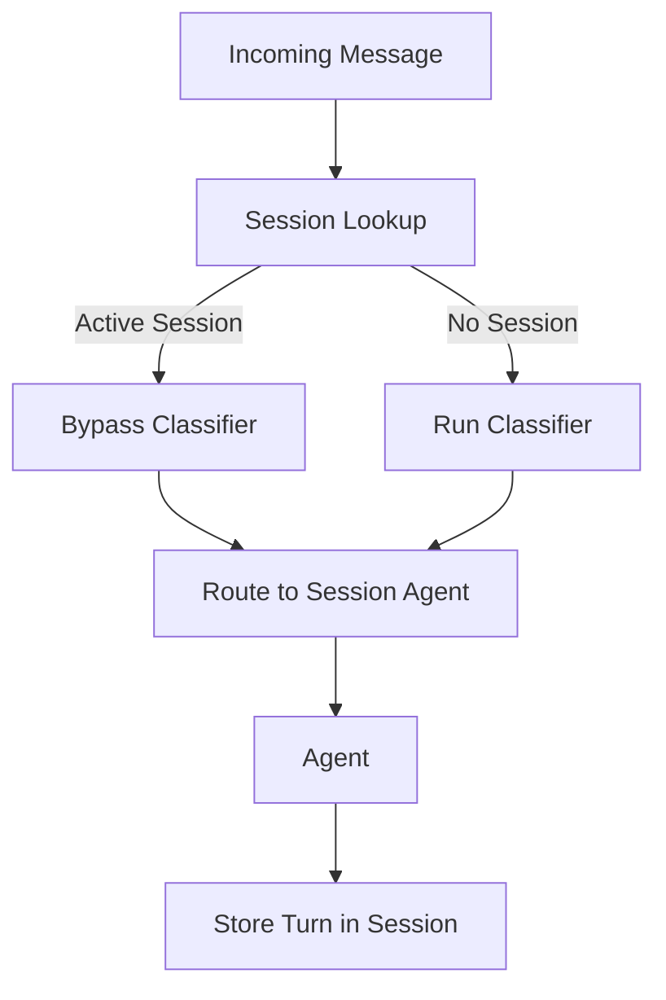

# Session Bypass Pattern

## Abstract

The Session Bypass pattern skips classification and routing for active sessions by routing directly to the session's assigned agent. This pattern ensures conversational consistency, reduces latency for mid-turn messages, and prevents re-classification from disrupting ongoing conversations.

## Problem Statement

In multi-turn conversations, re-classifying each message can route mid-turn messages to different agents, breaking conversational context. The problem is how to maintain session continuity by ensuring all messages in a conversation are handled by the same agent, while still allowing new conversations to be properly classified.

## Context

This pattern arises when:
- Multi-turn conversations span multiple messages
- Conversational context must be maintained
- Re-classification could disrupt ongoing conversations
- Latency reduction for mid-turn messages is valuable
- Session state needs to be preserved across turns

## Forces

- **Consistency vs. Flexibility:** Session continuity ensures consistency but prevents mid-conversation agent switching
- **Latency vs. Accuracy:** Bypass reduces latency but skips classification
- **State vs. Stateless:** Session state enables continuity but adds complexity
- **Hard vs. Soft Bypass:** Hard bypass always skips; soft bypass allows override

## Solution

### Architecture Diagram



### Components

- **Session Store:** Persistent storage for session state and turn history
- **Session Middleware:** Intercepts requests and checks for active sessions
- **Bypass Flag:** Indicator that classification should be skipped
- **TTL Manager:** Manages session expiration and cleanup

### Formal Properties

**Invariants:**
- Active sessions always bypass classification
- Session agent assignment is immutable during session lifetime
- Session TTL is refreshed on each turn

**Guarantees:**
- All messages in a session route to the same agent
- New conversations are properly classified
- Sessions expire after inactivity

**Bounds:**
- Session lifetime: bounded by TTL (typically 30 minutes)
- Turn history: bounded by storage limit
- Session lookup latency: bounded by datastore performance

## Implementation

```typescript
interface Session {
  id: string;
  userId: string;
  agentId: string;
  status: 'active' | 'completed' | 'abandoned';
  ttl: Date;
  turnHistory: TurnEntry[];
  workflowState: Record<string, unknown>;
}

interface TurnEntry {
  role: 'user' | 'agent';
  content: string;
  timestamp: string;
}

class SessionMiddleware {
  constructor(private sessionStore: SessionStore) {}

  async process(request: Request): Promise<{ bypassClassifier: boolean; agentId?: string }> {
    // Look up active session for user
    const session = await this.sessionStore.getActiveSession(request.userId);
    
    if (session && session.status === 'active' && session.ttl > new Date()) {
      // Active session: bypass classifier
      await this.sessionStore.refreshTTL(session.id);
      return {
        bypassClassifier: true,
        agentId: session.agentId
      };
    }
    
    // No active session: proceed with classification
    return { bypassClassifier: false };
  }

  async createSession(userId: string, agentId: string): Promise<Session> {
    const session: Session = {
      id: generateUUID(),
      userId,
      agentId,
      status: 'active',
      ttl: new Date(Date.now() + 30 * 60 * 1000), // 30 minutes
      turnHistory: [],
      workflowState: {}
    };
    
    await this.sessionStore.createSession(session);
    return session;
  }

  async appendTurn(sessionId: string, entry: TurnEntry): Promise<void> {
    await this.sessionStore.appendTurn(sessionId, entry);
    await this.sessionStore.refreshTTL(sessionId);
  }
}
```

## Failure Modes

| Failure | Detection | Recovery |
|---------|-----------|----------|
| Session lookup timeout | Datastore timeout | Continue without bypass (classify normally) |
| Stale session | TTL expired but not cleaned | TTL check catches this |
| Session store unavailable | Connection failure | Fail open (classify normally) |
| Orphaned sessions | Sessions not cleaned up | TTL-based garbage collection |

## When NOT to Use

- **Single-turn interactions:** If interactions are single-turn, session management adds overhead
- **Stateless systems:** If no state needs to be preserved, session bypass is unnecessary
- **Dynamic routing required:** If mid-conversation agent switching is needed, use soft bypass
- **High churn:** If sessions are very short-lived, overhead may exceed benefits

## Cross-References

### Related Patterns
- **Router** (Part I) — Session bypass skips the router
- **Session Management** (Part III) — Underlying session infrastructure
- **Idempotency Cache** (Part III) — Complementary state management pattern

### External Implementations
- **agent-mesh** — `src/session/session.middleware.ts` with Firestore backend

## References

- **agent-mesh ARCHITECTURE.md** — Session bypass implementation
- **Session Management Patterns** — Fowler's P of EAA
- **Firestore TTL documentation** — Automatic session cleanup
