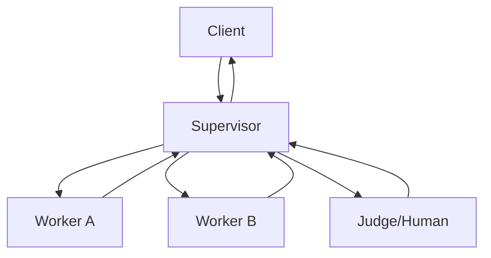

# Supervisor Pattern

## Abstract

The Supervisor pattern provides hierarchical oversight with escalation paths in multi-agent systems. A supervisor agent monitors worker agents, evaluates their outputs, and escalates complex or uncertain cases to higher-level agents or human operators. This pattern enables quality control, risk management, and progressive refinement of outputs.

## Problem Statement

In multi-agent systems, worker agents may produce incorrect or low-confidence outputs. Without oversight, these errors propagate to end users. The problem is how to provide hierarchical quality control with clear escalation paths while maintaining system responsiveness and avoiding bottlenecks at higher levels.

## Context

This pattern arises when:
- Worker agents have varying levels of reliability
- Some decisions require human judgment
- Risk management requires oversight
- Quality must be balanced against response time
- Escalation paths need to be clearly defined

## Forces

- **Quality vs. Latency:** More oversight improves quality but increases latency
- **Automation vs. Human Judgment:** Full automation is fast but may miss edge cases
- **Centralization vs. Distribution:** Centralized supervision is consistent but creates bottlenecks
- **Escalation Threshold:** Too low causes excessive escalation; too high misses errors

## Solution

### Architecture Diagram



### Components

- **Supervisor:** Monitors worker outputs, evaluates confidence, decides on escalation
- **Worker:** Specialized agent that processes requests under supervision
- **Judge:** Higher-level agent or human operator for escalated cases
- **Escalation Policy:** Rules defining when and how to escalate

### Formal Properties

**Invariants:**
- Every worker output is evaluated by supervisor
- Escalation decisions are deterministic for same inputs
- Escalated cases always receive response within SLA

**Guarantees:**
- Low-confidence outputs are escalated
- Worker errors do not reach end users
- Escalation does not exceed capacity limits

**Bounds:**
- Escalation rate: bounded by policy thresholds
- Supervisor processing: O(1) per worker output
- Judge queue: bounded by capacity

## Implementation

```typescript
interface SupervisorConfig {
  escalationThreshold: number;
  maxEscalationsPerMinute: number;
  defaultAction: 'approve' | 'escalate' | 'reject';
}

class Supervisor {
  private config: SupervisorConfig;
  private escalationCounter = 0;
  private lastResetTime = Date.now();

  async evaluate(workerOutput: { confidence: number; result: unknown }): Promise<{ action: string; result: unknown }> {
    // Reset counter every minute
    if (Date.now() - this.lastResetTime > 60000) {
      this.escalationCounter = 0;
      this.lastResetTime = Date.now();
    }

    // Check escalation threshold
    if (workerOutput.confidence < this.config.escalationThreshold) {
      if (this.escalationCounter >= this.config.maxEscalationsPerMinute) {
        // Rate limit exceeded, use default action
        return { action: this.config.defaultAction, result: workerOutput.result };
      }
      
      this.escalationCounter++;
      return this.escalate(workerOutput);
    }

    return { action: 'approve', result: workerOutput.result };
  }

  private async escalate(output: { confidence: number; result: unknown }): Promise<{ action: string; result: unknown }> {
    // Send to judge/human for review
    const judgeResult = await this.callJudge(output);
    return { action: 'escalated', result: judgeResult };
  }
}
```

## Failure Modes

| Failure | Detection | Recovery |
|---------|-----------|----------|
| Supervisor overload | Queue depth exceeds threshold | Increase threshold, add supervisors |
| Judge unavailable | Connection timeout | Use default action, queue for later |
| Escalation storm | Escalation rate exceeds limit | Raise threshold temporarily |
| Worker gaming | Workers always report high confidence | Add independent confidence estimation |

## When NOT to Use

- **High reliability workers:** If workers are highly reliable, supervision adds unnecessary overhead
- **Real-time requirements:** Supervision adds latency unsuitable for real-time systems
- **Simple tasks:** For simple tasks, supervision complexity is not justified
- **Well-defined domains:** In domains with clear rules, rule-based validation may suffice

## Cross-References

### Related Patterns
- **Confidence Gate** (Part IV) — Threshold-based routing without hierarchy
- **Consensus Voting** (Part IV) — Multiple opinions instead of hierarchy
- **LLM-as-Judge** (Part IV) — Automated quality evaluation

## References

- **Managing Crowds** (Kittur et al., 2013) — Hybrid human-AI systems
- **Human-in-the-Loop Machine Learning** (Amershi et al., 2014) — Interactive ML patterns
