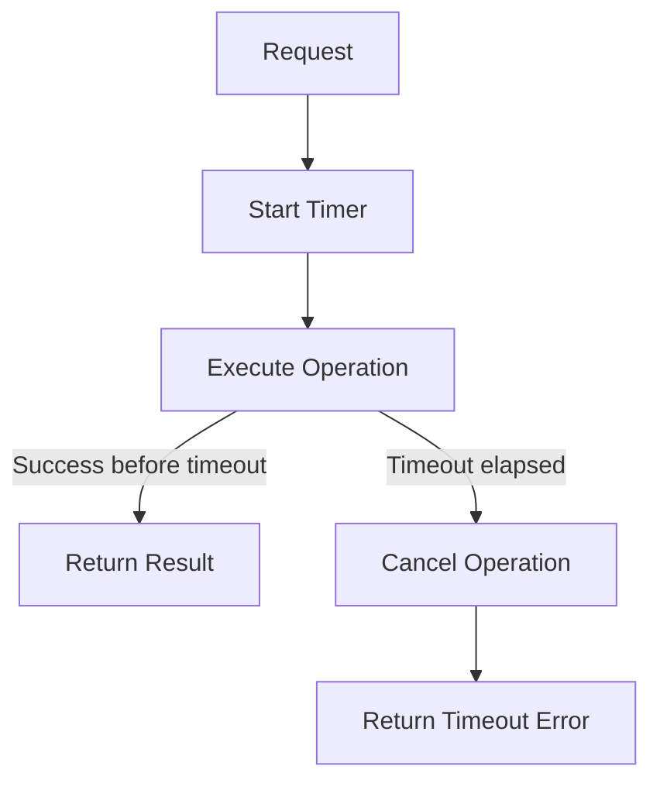

# Timeout Pattern

## Abstract

The Timeout pattern bounds waiting time for operations by cancelling requests that exceed a maximum duration. This pattern prevents resource exhaustion from hanging requests, ensures predictable response times, and enables faster failure detection and recovery.

## Problem Statement

Operations that wait indefinitely for responses can exhaust system resources and cause cascading failures. The problem is how to bound waiting time for operations, release resources when operations take too long, and provide predictable response times to users.

## Context

This pattern arises when:
- Operations involve external service calls
- Network latency is unpredictable
- Resource exhaustion from hanging requests is a concern
- Predictable response times are required
- Fast failure detection enables faster recovery

## Forces

- **Patience vs. Resource Protection:** Longer timeouts allow slow operations but tie up resources
- **Global vs. Per-Operation:** Global timeouts are simpler; per-operation timeouts are more precise
- **Hard vs. Soft:** Hard timeouts cancel immediately; soft timeouts allow grace period
- **Client vs. Server:** Client-side timeouts protect clients; server-side protect servers

## Solution

### Architecture Diagram



### Components

- **Timeout Manager:** Tracks operation timing and enforces limits
- **Cancellation Token:** Signal to cancel operation when timeout expires
- **Resource Cleanup:** Releases resources when operation is cancelled
- **Timeout Policy:** Configures timeout duration and behavior

### Formal Properties

**Invariants:**
- Operation is cancelled when timeout expires
- Resources are released after cancellation
- Timeout is measured from request start

**Guarantees:**
- Operation completes or is cancelled within timeout + cleanup time
- Resources are always released after timeout
- Caller receives timeout notification

**Bounds:**
- Timeout duration: configurable per operation type
- Cleanup time: bounded by resource release time
- Total request time: bounded by timeout + cleanup

## Implementation

```typescript
class TimeoutError extends Error {
  constructor(operation: string, timeoutMs: number) {
    super(`Operation '${operation}' timed out after ${timeoutMs}ms`);
    this.name = 'TimeoutError';
  }
}

async function withTimeout<T>(
  operation: Promise<T>,
  timeoutMs: number,
  operationName: string = 'unnamed'
): Promise<T> {
  const timeoutPromise = new Promise<never>((_, reject) => {
    const timer = setTimeout(() => {
      clearTimeout(timer);
      reject(new TimeoutError(operationName, timeoutMs));
    }, timeoutMs);
  });

  return Promise.race([operation, timeoutPromise]);
}

// Usage with cancellation
class CancellableOperation {
  private cancelled = false;
  private abortController: AbortController;

  constructor() {
    this.abortController = new AbortController();
  }

  cancel(): void {
    this.cancelled = true;
    this.abortController.abort();
  }

  async execute(timeoutMs: number): Promise<string> {
    try {
      const result = await withTimeout(
        this.doWork(this.abortController.signal),
        timeoutMs,
        'CancellableOperation.execute'
      );
      return result;
    } catch (error) {
      if (error instanceof TimeoutError) {
        this.cancel();
      }
      throw error;
    }
  }

  private async doWork(signal: AbortSignal): Promise<string> {
    // Check signal.isAborted in long-running operations
    while (!this.cancelled) {
      if (signal.aborted) {
        throw new Error('Operation cancelled');
      }
      // Do work...
    }
    return 'completed';
  }
}
```

## Failure Modes

| Failure | Detection | Recovery |
|---------|-----------|----------|
| Timeout too short | Legitimate operations fail | Increase timeout, optimize operation |
| Timeout too long | Resources still exhausted | Decrease timeout, add circuit breaker |
| Orphaned resources | Resources not released | Implement proper cleanup handlers |
| Timeout storm | Many timeouts simultaneously | Add jitter, use adaptive timeouts |

## When NOT to Use

- **Batch operations:** For long-running batch jobs, use heartbeat instead
- **Streaming operations:** For streaming, use idle timeout instead of total timeout
- **Unpredictable operations:** If operation time is highly variable, use adaptive timeout
- **Critical operations:** For operations that must complete, use retry instead of timeout

## Cross-References

### Related Patterns
- **Circuit Breaker** (Part II) — Timeout failures contribute to circuit breaker state
- **Retry with Backoff** (Part II) — Retry after timeout with backoff
- **Bulkhead** (Part II) — Timeout prevents bulkhead resource exhaustion

## References

- **Release It!** (Nygard, 2007) — Timeout pattern
- **Google SRE Book** — Timeout and retry best practices
- **AWS Well-Architected Framework** — Timeout configuration guidelines
