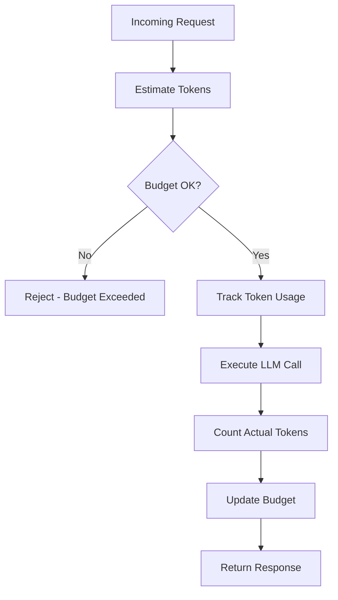

# Token Budget Pattern

## Abstract

The Token Budget pattern manages LLM token consumption to prevent cost overruns and ensure predictable API usage. By tracking token counts across requests, enforcing per-session and per-user limits, and providing cost estimation, this pattern enables cost-aware agent design and prevents runaway API bills.

## Problem Statement

LLM API costs are directly proportional to token usage, and unchecked token consumption can lead to unexpected costs. The problem is how to track, limit, and optimize token usage across multiple requests while maintaining agent functionality and providing visibility into costs.

## Context

This pattern arises when:
- LLM API costs need to be controlled
- Budget limits must be enforced
- Token usage needs to be tracked per user/session
- Cost estimation is required before execution
- Token optimization is needed for efficiency

## Forces

- **Quality vs. Cost:** Higher quality responses use more tokens
- **Flexibility vs. Control:** Flexible budgets adapt to needs; strict budgets prevent overruns
- **Pre-estimation vs. Post-tracking:** Pre-estimation prevents overages; post-tracking is more accurate
- **Per-request vs. Aggregate:** Per-request limits are precise; aggregate limits are simpler

## Solution

### Architecture Diagram



### Components

- **Token Counter:** Counts tokens in prompts and responses
- **Budget Tracker:** Tracks token usage against budgets
- **Cost Estimator:** Estimates cost before execution
- **Budget Enforcer:** Enforces budget limits

### Formal Properties

**Invariants:**
- Token counts are accurate within model's tokenization
- Budgets are enforced before LLM calls
- Token usage is tracked atomically

**Guarantees:**
- Token usage never exceeds budget
- Cost estimates are within 10% of actual
- Budget resets on schedule

**Bounds:**
- Token count: bounded by model limits
- Budget period: bounded (daily, monthly)
- Estimation error: bounded

## Implementation

```typescript
interface TokenBudget {
  userId: string;
  sessionId?: string;
  dailyLimit: number;
  monthlyLimit: number;
  dailyUsed: number;
  monthlyUsed: number;
  resetDaily: string;
  resetMonthly: string;
}

interface TokenEstimate {
  inputTokens: number;
  outputTokens: number;
  totalTokens: number;
  estimatedCost: number;
}

class TokenBudgetManager {
  private budgets: Map<string, TokenBudget> = new Map();
  private tokenCounter: TokenCounter;
  private pricing: Map<string, { input: number; output: number }>;

  constructor(pricing: Map<string, { input: number; output: number }>) {
    this.tokenCounter = new TokenCounter();
    this.pricing = pricing;
  }

  getBudget(userId: string): TokenBudget | null {
    return this.budgets.get(userId) || null;
  }

  async estimateTokens(
    prompt: string,
    model: string,
    maxOutputTokens: number
  ): Promise<TokenEstimate> {
    const inputTokens = await this.tokenCounter.count(prompt, model);
    const outputTokens = maxOutputTokens; // Worst case
    const totalTokens = inputTokens + outputTokens;
    
    const modelPricing = this.pricing.get(model);
    const estimatedCost = modelPricing
      ? (inputTokens / 1_000_000) * modelPricing.input +
        (outputTokens / 1_000_000) * modelPricing.output
      : 0;

    return {
      inputTokens,
      outputTokens,
      totalTokens,
      estimatedCost,
    };
  }

  async checkBudget(userId: string, estimate: TokenEstimate): Promise<boolean> {
    let budget = this.budgets.get(userId);
    
    if (!budget) {
      // Create default budget
      budget = {
        userId,
        dailyLimit: 100_000, // 100K tokens/day
        monthlyLimit: 2_000_000, // 2M tokens/month
        dailyUsed: 0,
        monthlyUsed: 0,
        resetDaily: new Date().toISOString(),
        resetMonthly: new Date().toISOString(),
      };
      this.budgets.set(userId, budget);
    }

    // Check if budgets need reset
    this.checkResets(budget);

    // Check if usage would exceed limits
    return (
      budget.dailyUsed + estimate.totalTokens <= budget.dailyLimit &&
      budget.monthlyUsed + estimate.totalTokens <= budget.monthlyLimit
    );
  }

  async trackUsage(
    userId: string,
    inputTokens: number,
    outputTokens: number,
    model: string
  ): Promise<void> {
    const budget = this.budgets.get(userId);
    if (!budget) return;

    const totalTokens = inputTokens + outputTokens;
    budget.dailyUsed += totalTokens;
    budget.monthlyUsed += totalTokens;

    // Calculate cost
    const modelPricing = this.pricing.get(model);
    const cost = modelPricing
      ? (inputTokens / 1_000_000) * modelPricing.input +
        (outputTokens / 1_000_000) * modelPricing.output
      : 0;

    // Log for cost tracking
    this.logUsage(userId, totalTokens, cost);
  }

  private checkResets(budget: TokenBudget): void {
    const now = new Date();
    
    // Reset daily if needed
    if (new Date(budget.resetDaily) < now) {
      budget.dailyUsed = 0;
      budget.resetDaily = new Date(
        now.getFullYear(),
        now.getMonth(),
        now.getDate() + 1
      ).toISOString();
    }

    // Reset monthly if needed
    if (new Date(budget.resetMonthly) < now) {
      budget.monthlyUsed = 0;
      budget.resetMonthly = new Date(
        now.getFullYear(),
        now.getMonth() + 1,
        1
      ).toISOString();
    }
  }
}

// Usage
const budgetManager = new TokenBudgetManager(new Map([
  ['gpt-4', { input: 30, output: 60 }], // $30/M input, $60/M output
  ['gpt-3.5-turbo', { input: 0.5, output: 1.5 }],
]));

// Before LLM call
const estimate = await budgetManager.estimateTokens(prompt, 'gpt-4', 1000);
if (!(await budgetManager.checkBudget(userId, estimate))) {
  return { error: 'Token budget exceeded' };
}

// After LLM call
await budgetManager.trackUsage(userId, inputTokens, outputTokens, 'gpt-4');
```

## Failure Modes

| Failure | Detection | Recovery |
|---------|-----------|----------|
| Token counter unavailable | API timeout | Use fallback estimation, fail open |
| Budget tracking race | Concurrent updates | Use atomic operations, retry |
| Pricing data stale | Price change | Update pricing, recalculate |
| Budget reset failure | Clock skew | Manual reset, alert |

## When NOT to Use

- **Fixed-cost APIs:** For flat-rate APIs, token tracking is unnecessary
- **Internal models:** For self-hosted models, cost is not token-based
- **Low-volume usage:** For low-volume usage, budget tracking adds overhead
- **Research/development:** In dev environments, strict budgets may hinder experimentation

## Cross-References

### Related Patterns
- **LLM Router** — Router can consider token costs
- **Cost Telemetry** — Token usage feeds into cost tracking
- **Rate Limiter** — Token budgets complement rate limits

## References

- **OpenAI Tokenizer** — Token counting for GPT models
- **Anthropic Token Counting** — Claude token counting
- **LLM Pricing** — Current pricing for major providers
