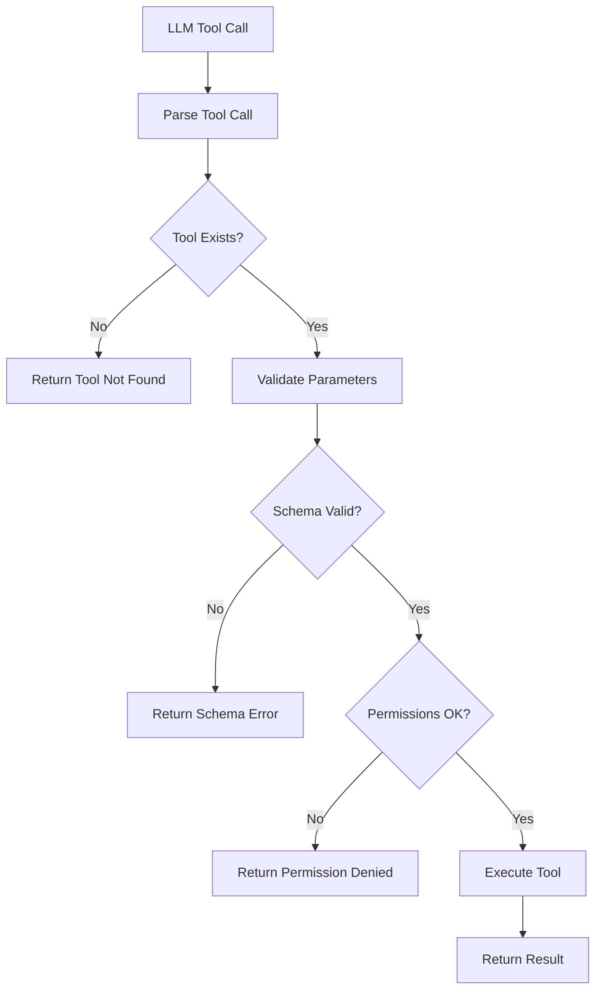

# Tool Use Validation Pattern

## Abstract

The Tool Use Validation pattern validates LLM-generated tool calls before execution. By checking tool existence, parameter schemas, and permission requirements, this pattern prevents invalid tool invocations that could cause errors, security breaches, or unintended side effects.

## Problem Statement

LLMs can generate tool calls with incorrect parameters, non-existent tools, or unauthorized operations. The problem is how to validate tool calls before execution to ensure they are well-formed, authorized, and safe, while providing clear error messages for correction.

## Context

This pattern arises when:
- LLMs generate tool calls dynamically
- Tools have strict parameter schemas
- Permission checking is required
- Invalid tool calls could cause harm
- Clear error feedback is needed for LLM correction

## Forces

- **Strictness vs. Flexibility:** Strict validation prevents errors but may reject valid calls
- **Pre-validation vs. Post-validation:** Pre-validation prevents execution; post-validation catches runtime issues
- **Schema Complexity:** Complex schemas are expressive but harder to validate
- **Performance vs. Thoroughness:** Thorough validation is safer but slower

## Solution

### Architecture Diagram



### Components

- **Tool Registry:** Catalog of available tools with schemas
- **Schema Validator:** Validates parameters against tool schemas
- **Permission Checker:** Verifies caller has required permissions
- **Error Formatter:** Generates clear error messages for LLM

### Formal Properties

**Invariants:**
- All tool calls are validated before execution
- Validation errors include actionable feedback
- Tool schemas are immutable during execution

**Guarantees:**
- Only valid tool calls are executed
- Invalid calls return descriptive errors
- Permission violations are always blocked

**Bounds:**
- Validation time: bounded by schema complexity
- Tool count: bounded by registry size
- Parameter depth: bounded for performance

## Implementation

```typescript
interface ToolDefinition {
  name: string;
  description: string;
  inputSchema: JSONSchema;
  requiredPermissions: string[];
}

interface ToolCall {
  name: string;
  arguments: Record<string, unknown>;
}

interface ValidationResult {
  valid: boolean;
  errors: string[];
  tool?: ToolDefinition;
}

class ToolUseValidator {
  private tools: Map<string, ToolDefinition>;
  private schemaValidator: JSONSchemaValidator;
  private permissionChecker: PermissionChecker;

  constructor(
    tools: Map<string, ToolDefinition>,
    schemaValidator: JSONSchemaValidator,
    permissionChecker: PermissionChecker
  ) {
    this.tools = tools;
    this.schemaValidator = schemaValidator;
    this.permissionChecker = permissionChecker;
  }

  async validate(toolCall: ToolCall, context: ValidationContext): Promise<ValidationResult> {
    const errors: string[] = [];

    // Check if tool exists
    const tool = this.tools.get(toolCall.name);
    if (!tool) {
      const availableTools = Array.from(this.tools.keys()).join(', ');
      return {
        valid: false,
        errors: [`Tool "${toolCall.name}" not found. Available tools: ${availableTools}`],
      };
    }

    // Validate parameters against schema
    const schemaErrors = this.schemaValidator.validate(
      toolCall.arguments,
      tool.inputSchema
    );
    if (schemaErrors.length > 0) {
      errors.push(...schemaErrors.map(e => `Parameter error: ${e.message}`));
    }

    // Check permissions
    const hasPermission = await this.permissionChecker.check(
      context.userId,
      tool.requiredPermissions
    );
    if (!hasPermission) {
      errors.push(`Permission denied. Required: ${tool.requiredPermissions.join(', ')}`);
    }

    return {
      valid: errors.length === 0,
      errors,
      tool,
    };
  }
}

// Usage: Validate before execution
const validator = new ToolUseValidator(tools, schemaValidator, permissionChecker);

const result = await validator.validate(toolCall, { userId, sessionId });
if (!result.valid) {
  return {
    content: `I cannot execute that tool call. Errors:\n${result.errors.join('\n')}`,
    workflow_complete: false,
  };
}

// Execute validated tool call
const toolResult = await executeTool(result.tool!, toolCall.arguments);
```

## Failure Modes

| Failure | Detection | Recovery |
|---------|-----------|----------|
| Schema validation slow | Timeout threshold | Cache validation results |
| Tool registry unavailable | Connection failure | Use cached registry, fail closed |
| Permission check timeout | External service timeout | Fail closed (deny), retry |
| Schema mismatch | Schema version conflict | Log error, return descriptive message |

## When NOT to Use

- **Fixed tool sets:** If tools are predetermined and validated at compile time
- **Simple tools:** For tools with no parameters, validation adds overhead
- **Trusted LLMs:** If LLM output is always trusted, validation may be unnecessary
- **Performance-critical:** If every millisecond counts, use sampling

## Cross-References

### Related Patterns
- **Router** (Part I) — Router may generate tool calls
- **Pipeline** (Part I) — Pipeline stages may use tools
- **Audit Logger** (Part VI) — Log all tool use attempts

## References

- **MCP Specification** — Tool definition schema
- **JSON Schema** — Parameter validation standard
- **OAuth 2.0** — Permission checking framework
